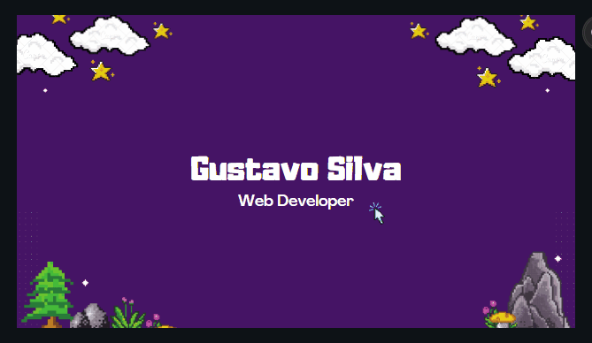

<h2 align="center">📋&ensp; <i>Ｓｏｂｒｅ</i> &ensp;📋</h2>

<!-- <table align="center">
  <tr>
    <td>
      <b>
        <a href="README.md">🇧🇷 Português</a>
      </b>
    </td>
    <td>
      <a href="README-EN.md">🇺🇸 English</a>
    </td>
  </tr>
</table> -->
<ul align="left">
    <li>☕ Respiranto Tecnologia, "What makes you rich is work", café e códigos. ☕</li> 
    <li>🚀 Sou um Desenvolvedor Frontend Júnior, ambicioso, hiperfocado e buscando crescer na área. Sempre fui um estudante/pesquisador autodidata em várias áreas (muitas colho benefícios até hoje) mas agora estou apontando tudo que tenho e me dedicando ao máximo ao ramo digital. 
    <li>🔮 Meu objetivo num futuro próximo, é me tornar Desenvolvedor-Fullstack (Frontend, Backend e Mobile). 🔮</li> 
</ul>
 

<h2 align="center">🛠️&ensp; <i>Ｔｅｃｎｏｌｏｇｉａ s</i> &ensp;🛠️</h2>

<table align="right" height="300px">
  <tr>
    <td align="center">
       
      
        <b>
          <pre>React</pre>
        </b>
      
    </td>
    <td align="center">
       
      
        <b>
          <pre>Angular</pre>
        </b>
      
    </td>
    <td align="center">
       
      
        <b>
          <pre>Next</pre>
        </b>
      
    </td>
    <td align="center">
       
      
        <b>
          <pre>TypeScript</pre>
        </b>
      
    </td>
    <td align="center">
       
      
        <b>
          <pre>JavaScript</pre>
        </b>
      
    </td>
  </tr>
  <tr>
    <td align="center" width="100px;">
       
      
        <b>
          <pre>Tailwind</pre>
        </b>
      
    </td>
    <td align="center">
       
      
        <b>
          <pre>Node</pre>
        </b>
      
    </td>
    <td align="center">
       
      
        <b>
          <pre>Vite</pre>
        </b>
      
    </td>
    <td align="center">
       
      
        <b>
          <pre>Jest</pre>
        </b>
      
    </td>
    <td align="center">
       
      
        <b>
          <pre>Redux</pre>
        </b>
      
    </td>
  </tr>
  <tr>
    <td align="center">
       
      
        <b>
          <pre>Material-UI</pre>
        </b>
      
    </td>
    <td align="center">
       
      
        <b>
          <pre>Bootstrap</pre>
        </b>
      
    </td>
    <td align="center" width="100px;">
       
      
        <b>
          <pre>Figma</pre>
        </b>
      
    </td>
    <td align="center">
       
      
        <b>
          <pre>HTML5</pre>
        </b>
      
    </td>
    <td align="center">
       
      
        <b>
          <pre>CSS3</pre>
        </b>
      
    </td>
  </tr>
  <tr>
    <td align="center">
       
      
        <b>
          <pre>Styled-Components</pre>
        </b>
      
    </td>
    <td align="center">
       
      
        <b>
          <pre>SASS</pre>
        </b>
      
    </td>
    <td align="center">
       
      
        <b>
          <pre>Github</pre>
        </b>
      
    </td>
    <td align="center">
       
      
        <b>
          <pre>Git</pre>
        </b>
      
    </td>
    <td align="center" width="100px;">
       
      
        <b>
          <pre>JQuery</pre>
        </b>
      
    </td>
  </tr>
</table> 
               

<h2 align="center">💬&ensp; <i>Ｃｏｎｔａｔｏ</i> &ensp;💬</h2>

  

  
   
   
  
  
  
  

   

<!-- <h2 align="center">👨🏻‍💻&ensp; <i>Ｐｒｏｊｅｔｏｓ</i> &ensp;👨🏻‍💻</h2>

<table height="495px" width="365px">
  <tr>
    <td>
    
    </td>
  </tr>
  <tr>
    <td>
    
    </td>
  </tr>
  <tr>
    <td>
    
    </td>
  </tr>
  <tr>
    <td>
    
    </td>
  </tr>
  <tr>
    <td>
    
    </td>
  </tr>
  <tr>
    <td>
    
    </td>
  </tr>
  <tr>
    <td>
    
    </td>
  </tr>
  <tr>
    <td>
     
    </td>
  </tr>
  <tr>
    <td>
    
    </td>
  </tr>
  <tr>
    <td>
    
    </td>
  </tr>
  <tr>
    <td>
    
    </td>
  </tr>
  <tr>
    <td>
    
    </td>
  </tr>
  <tr>
    <td>
    
    </td>
  </tr>
  <tr>
    <td>
    
    </td>
  </tr>
  <tr>
    <td>
    
    </td>
  </tr>
  <tr>
    <td>
    
    </td>
  </tr>
  <tr>
    <td>
    
    </td>
  </tr>
  <tr>
    <td>
    
    </td>
  </tr>
</table>
 

<h2 align="center"> -->
<!-- 

📈&ensp; <i>Ａｔｉｖｉｄａｄｅ</i> &ensp;📈

 

  

 

 -->